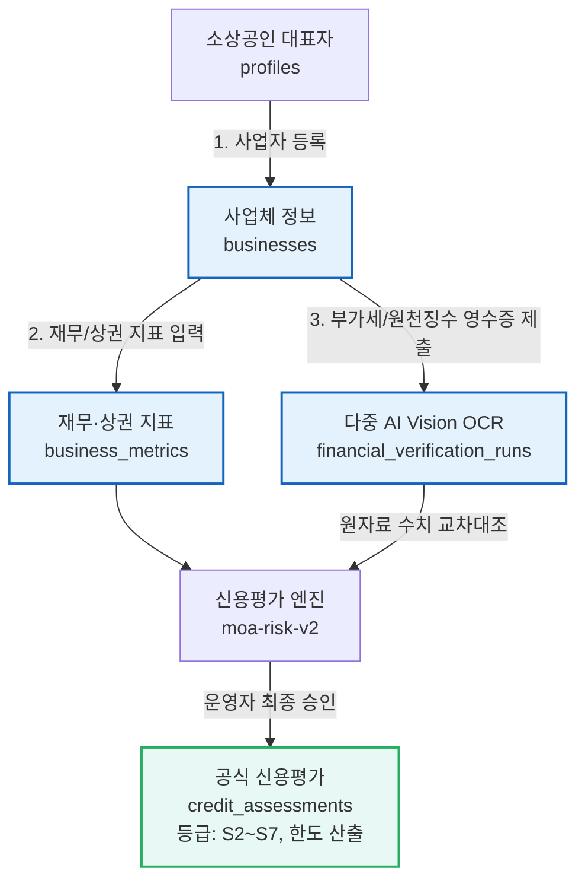
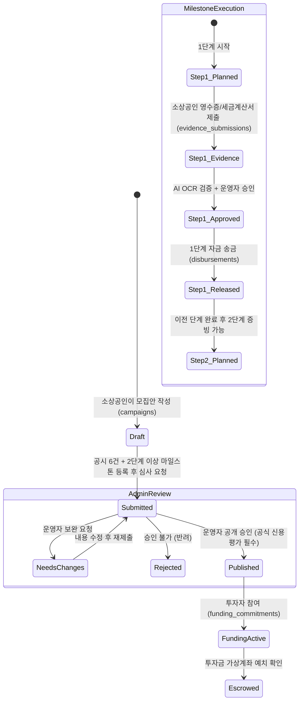

# 📊 MOA (모아) 데이터베이스 ERD 및 스키마 구조도

> **💡 미리보기 단축키 (Preview Guide)**
> - **VS Code / Cursor / Windsurf**: `Ctrl + Shift + V` (macOS: `Cmd + Shift + V` 또는 `Cmd + K V`)
> - 마크다운 미리보기를 열면 아래의 **Mermaid ER 다이어그램**이 시각화된 인터랙티브 구조도로 렌더링됩니다.

---

## 1. 전체 ER 다이어그램 (Full Entity-Relationship Diagram)

```mermaid
erDiagram
    %% ==========================================
    %% 1. 계정 및 인증 (Authentication & Profile)
    %% ==========================================
    PROFILES ||--o{ LOGIN_EVENTS : "logs"
    PROFILES ||--o| USER_SETTINGS : "has_settings"
    PROFILES ||--o{ BUSINESSES : "operates"
    PROFILES ||--o{ CAMPAIGNS : "registers"
    PROFILES ||--o{ FUNDING_COMMITMENTS : "invests"
    PROFILES ||--o{ FINANCIAL_VERIFICATION_RUNS : "requests"
    PROFILES ||--o{ OCR_ANALYSES : "runs_ocr"
    PROFILES ||--o{ EVIDENCE_SUBMISSIONS : "submits_evidence"
    PROFILES ||--o{ DISBURSEMENTS : "approves_disbursement"
    PROFILES ||--o{ AUDIT_EVENTS : "performs_action"

    %% ==========================================
    %% 2. 소상공인 및 신용평가 (Business & Credit)
    %% ==========================================
    BUSINESSES ||--|| BUSINESS_METRICS : "has_metrics"
    BUSINESSES ||--o{ FINANCIAL_VERIFICATION_RUNS : "verified_through"
    BUSINESSES ||--o{ CREDIT_ASSESSMENTS : "evaluated_by"
    FINANCIAL_VERIFICATION_RUNS ||--o{ CREDIT_ASSESSMENTS : "links_official_run"
    BUSINESSES ||--o{ CAMPAIGNS : "launches"
    BUSINESSES ||--o{ OCR_ANALYSES : "owns_receipts"
    BUSINESSES ||--o{ KNOWLEDGE_NODES : "scope_business"

    %% ==========================================
    %% 3. 크라우드펀딩 & 마일스톤 (Campaign & Escrow)
    %% ==========================================
    CAMPAIGNS ||--|{ CAMPAIGN_MILESTONES : "divided_into"
    CAMPAIGNS ||--o{ FUNDING_COMMITMENTS : "receives_funds"
    CAMPAIGNS ||--o{ EVIDENCE_SUBMISSIONS : "has_evidence"
    CAMPAIGNS ||--o{ DISBURSEMENTS : "executes_payout"

    %% ==========================================
    %% 4. 마일스톤 증빙 및 지급 (Evidence & Payout)
    %% ==========================================
    CAMPAIGN_MILESTONES ||--o{ EVIDENCE_SUBMISSIONS : "verifies_with"
    CAMPAIGN_MILESTONES ||--o| DISBURSEMENTS : "triggers_release"
    OCR_ANALYSES ||--o{ EVIDENCE_SUBMISSIONS : "attaches_analysis"

    %% ==========================================
    %% 5. 지식 그래프 온톨로지 (Knowledge Graph)
    %% ==========================================
    KNOWLEDGE_NODES ||--o{ KNOWLEDGE_EDGES : "source_node"
    KNOWLEDGE_NODES ||--o{ KNOWLEDGE_EDGES : "target_node"

    %% ------------------------------------------
    %% Entity Definitions with Attributes
    %% ------------------------------------------

    PROFILES {
        uuid id PK "auth.users(id) FK"
        string email "사용자 이메일"
        string display_name "표시 이름 (대표자명)"
        string role "investor | owner | admin"
        timestamptz created_at "생성일"
        timestamptz updated_at "수정일"
    }

    LOGIN_EVENTS {
        bigint id PK "자동증가 ID"
        uuid user_id FK "profiles(id)"
        string event_type "login_success | logout"
        string user_agent "접속 기기/브라우저"
        timestamptz created_at "로그 일시"
    }

    USER_SETTINGS {
        uuid user_id PK "profiles(id) FK"
        string region "관심/활동 지역 (예: 서울 전체)"
        string_array disclosures "동의한 필수 공시 항목 6개"
        timestamptz updated_at "수정일"
    }

    BUSINESSES {
        uuid id PK "사업체 고유 UUID"
        uuid user_id FK "profiles(id) 대표자"
        string name "상호명"
        string category "업종 (카페, 베이커리 등)"
        string business_number "사업자등록번호"
        string address "사업장 소재지 주소"
        bigint monthly_sales "월 평균 매출액 (원)"
        numeric business_age "업력 (연수)"
        string description "가게 소개글"
        string owner_story "대표 스토리 (AI 생성 연동)"
        jsonb highlights "강점 태그 목록"
        jsonb menu_items "대표 메뉴 목록"
        string verification_status "unverified | pending | verified | rejected"
        string verification_note "검증 심사 메모"
        boolean is_demo "데모/샘플 데이터 여부"
        timestamptz created_at "등록일"
        timestamptz updated_at "수정일"
    }

    BUSINESS_METRICS {
        uuid business_id PK "businesses(id) FK"
        bigint_array sales_6m "최근 6개월 매출 추이"
        bigint operating_cash_flow "영업현금흐름"
        bigint debt_total "총 부채금액"
        bigint monthly_debt_payment "월 부채 상환액"
        integer overdue_count "연체 이력 횟수"
        integer employee_count "고용 직원 수"
        boolean tax_compliant "세금 체납 여부(성실납세)"
        numeric foot_traffic_growth "상권 유동인구 증가율"
        numeric local_sales_growth "상권 매출 성장률"
        numeric competitor_density "반경 내 경쟁점 밀도"
        numeric closure_rate "상권 평균 폐업률"
        numeric repeat_rate "단골/재방문 비율"
        numeric digital_sales_ratio "디지털/배달 매출 비중"
        jsonb source_dates "지표 기준일 정보"
        timestamptz updated_at "수정일"
    }

    FINANCIAL_VERIFICATION_RUNS {
        uuid id PK "검증 세션 UUID"
        uuid business_id FK "businesses(id)"
        uuid user_id FK "profiles(id)"
        jsonb claimed_metrics "신청자가 주장한 수치"
        jsonb document_results "다중 OCR 문서 추출 결과"
        jsonb orchestration "교차검증 불일치 분석"
        string model "사용된 AI 모델 버전"
        string status "needs_documents | mismatch | ready_for_admin | approved | rejected"
        string review_note "운영자 검토 의견"
        uuid reviewed_by FK "profiles(id) 심사자"
        timestamptz reviewed_at "심사 일시"
        timestamptz created_at "검증 요청일"
        timestamptz updated_at "수정일"
    }

    CREDIT_ASSESSMENTS {
        bigint id PK "평가 결과 ID"
        uuid business_id FK "businesses(id)"
        uuid verification_run_id FK "financial_verification_runs(id)"
        numeric score "종합 신용점수 (0~100)"
        string s_grade "소상공인 등급 (S2~S7)"
        string risk_level "low | review | high"
        bigint funding_limit "추천 펀딩 한도액"
        jsonb components "5대 지표별 가중치/세부점수"
        string_array missing_fields "누락 데이터 필드"
        string model_version "평가 모형 버전 (moa-risk-v2)"
        boolean is_official "운영자 승인 공식 평가 여부"
        timestamptz created_at "평가 일시"
    }

    CAMPAIGNS {
        uuid id PK "모집안 고유 UUID"
        uuid user_id FK "profiles(id) 발행인"
        uuid business_id FK "businesses(id) 사업체"
        string name "펀딩 프로젝트명"
        bigint target_amount "목표 모집금액 (최소 10만원)"
        integer duration_days "모집 기간 (일)"
        string plan "자금 사용 계획"
        string risk "주요 사업 위험 요인 및 대책"
        string status "draft | submitted | needs_changes | published | rejected"
        string review_note "운영자 심사 피드백"
        timestamptz published_at "공개 승인일시"
        timestamptz created_at "작성일"
        timestamptz updated_at "수정일"
    }

    CAMPAIGN_MILESTONES {
        uuid id PK "마일스톤 고유 UUID"
        uuid campaign_id FK "campaigns(id)"
        integer sequence_no "단계 순번 (1, 2, ...)"
        string title "단계명 (예: 인테리어 1차)"
        string condition_text "지급 실행 조건"
        numeric release_percent "해당 단계 지급 비율 (%)"
        string status "planned | evidence_submitted | approved | rejected | released"
        date due_date "예정 완료일"
        timestamptz created_at "생성일"
        timestamptz updated_at "수정일"
    }

    FUNDING_COMMITMENTS {
        uuid id PK "투자 약정 고유 UUID"
        uuid campaign_id FK "campaigns(id)"
        uuid investor_id FK "profiles(id) 투자자"
        bigint amount "투자 참여 금액 (원)"
        boolean risk_consent "투자 위험 고지 동의"
        string status "committed | escrowed | cancelled | refunded"
        timestamptz created_at "약정 일시"
        timestamptz updated_at "상태 갱신일"
    }

    OCR_ANALYSES {
        uuid id PK "OCR 분석 고유 UUID"
        uuid user_id FK "profiles(id)"
        uuid business_id FK "businesses(id)"
        string filename "업로드된 원본 파일명"
        string plan "마일스톤 집행 계획"
        jsonb result "Vision AI 파싱 JSON 결과"
        string model "분석 모델명"
        timestamptz created_at "분석 일시"
    }

    EVIDENCE_SUBMISSIONS {
        uuid id PK "증빙 제출 UUID"
        uuid milestone_id FK "campaign_milestones(id)"
        uuid campaign_id FK "campaigns(id)"
        uuid business_id FK "businesses(id)"
        uuid user_id FK "profiles(id) 제출자"
        uuid ocr_analysis_id FK "ocr_analyses(id)"
        string filename "증빙 파일명"
        bigint claimed_amount "청구 금액"
        string plan_match "계획 일치도 (일치/검토필요)"
        jsonb result "검증 상세 데이터"
        string status "pending | approved | rejected"
        string review_note "운영자 검토 의견"
        uuid reviewed_by FK "profiles(id) 심사자"
        timestamptz reviewed_at "심사 일시"
        timestamptz created_at "제출일"
        timestamptz updated_at "수정일"
    }

    DISBURSEMENTS {
        uuid id PK "지급 실행 고유 UUID"
        uuid milestone_id UK "campaign_milestones(id) 1:1"
        uuid campaign_id FK "campaigns(id)"
        bigint amount "실제 송금/지급 금액"
        string status "approved | released | cancelled"
        uuid approved_by FK "profiles(id) 승인 운영자"
        timestamptz released_at "지급 실행 일시"
        timestamptz created_at "생성일"
    }

    AUDIT_EVENTS {
        bigint id PK "감사 로그 고유 ID"
        uuid actor_user_id FK "profiles(id) 행위자"
        string action "수행 액션 (campaign_submit 등)"
        string entity_type "대상 테이블/도메인"
        string entity_id "대상 레코드 ID"
        jsonb detail "변경 상세 스냅샷"
        timestamptz created_at "기록 일시"
    }

    KNOWLEDGE_NODES {
        string id PK "노드 고유 식별자 (GUID/Slug)"
        string role_scope "shared | investor | owner"
        uuid business_id FK "businesses(id)"
        string node_type "GuideStep | PolicyRule | MetricFact 등"
        string label "노드 라벨 및 제목"
        jsonb properties "동적 속성 및 근거 데이터"
        string source_ref "출처 (MOA_SERVICE_POLICY 등)"
        string verification_status "policy_verified | unverified"
        timestamptz updated_at "수정일"
    }

    KNOWLEDGE_EDGES {
        bigint id PK "엣지 고유 ID"
        string source_node_id FK "knowledge_nodes(id)"
        string target_node_id FK "knowledge_nodes(id)"
        string relation_type "REQUIRES | VALIDATES | NEXT_STEP 등"
        numeric weight "가중치/우선순위"
        jsonb properties "관계 부가 속성"
        timestamptz updated_at "수정일"
    }
```



---

## 2. 도메인별 핵심 관계도 및 비즈니스 로직

### ① 소상공인 등록 & AI 신용평가 파이프라인



---

### ② 마일스톤 기반 단계별 에스크로 펀딩 생명주기



---

## 3. 테이블별 상세 정의서 (Data Dictionary)

| 구분 | 테이블명 | 설명 | 주요 PK/FK 및 연관관계 |
|:---:|:---|:---|:---|
| **인증** | `profiles` | 사용자 기본 프로필 (투자자/소상공인/관리자) | `id` (PK, `auth.users` 연동) |
| **로그** | `login_events` | 로그인 및 세션 기록 (보안 감사) | `user_id` -> `profiles(id)` |
| **설정** | `user_settings` | 지역 필터 및 6대 필수 공시 체크 | `user_id` -> `profiles(id)` |
| **사업** | `businesses` | 가게/소상공인 기본 정보 및 소개 스토리 | `user_id` -> `profiles(id)` |
| **지표** | `business_metrics` | 6개월 매출, 부채, 상권 유동인구 등 평가 지표 | `business_id` (PK/FK) -> `businesses(id)` |
| **검증** | `financial_verification_runs` | 모집 전 재무자료 다중 OCR 및 주장 대조 검증 원장 | `business_id`, `user_id`, `reviewed_by` |
| **평가** | `credit_assessments` | AI 신용평가 산출 결과 (S2~S7 점수/한도/리스크) | `business_id`, `verification_run_id` |
| **모집** | `campaigns` | 크라우드펀딩 프로젝트 모집안 | `user_id`, `business_id` |
| **단계** | `campaign_milestones` | 단계별 자금 사용 계획 및 집행 조건 | `campaign_id` -> `campaigns(id)` |
| **투자** | `funding_commitments` | 투자자 참여 약정 및 예치금 상태 | `campaign_id`, `investor_id` |
| **OCR** | `ocr_analyses` | 영수증/세금계산서 AI 파싱 원본 데이터 | `user_id`, `business_id` |
| **증빙** | `evidence_submissions` | 단계별 마일스톤 증빙 자료 제출 내역 | `milestone_id`, `campaign_id`, `ocr_analysis_id` |
| **지급** | `disbursements` | 검증 통과 후 실제 자금 방출/송금 내역 | `milestone_id` (1:1), `approved_by` |
| **감사** | `audit_events` | 모든 주요 상태 변경 이벤트 추적 원장 | `actor_user_id` -> `profiles(id)` |
| **지식** | `knowledge_nodes` | 역할별 가이드 및 온톨로지 지식 노드 | `business_id` (옵션 FK) |
| **관계** | `knowledge_edges` | 지식 노드 간의 논리적 인과/조건 연결선 | `source_node_id`, `target_node_id` |

---

## 4. 데이터베이스 제약조건 및 보안 규칙 (RLS & Triggers)

1. **Row Level Security (RLS)**:
   - 모든 테이블에 RLS 정책이 활성화되어 있어 일반 사용자는 본인(`auth.uid()`)에 속한 데이터만 수정/조회 가능합니다.
   - `admin` 역할 계정은 전역 검토 및 승인 RPC 함수(`review_campaign`, `review_evidence`, `release_milestone` 등)를 통해 전체 데이터 관리가 가능합니다.
2. **무결성 제약조건**:
   - 마일스톤 합계 비율(`release_percent`)은 반드시 100%여야 하며 2단계 이상 구성되어야 모집안 심사 제출이 가능합니다.
   - 마일스톤 증빙은 반드시 이전 순번(`sequence_no`)의 자금 지급(`released`)이 완료되어야 다음 단계 증빙 제출이 가능합니다.
   - 펀딩 승인(`published`)을 위해서는 `financial_verification_runs`의 승인을 거친 공식 신용평가(`credit_assessments.is_official = true`)가 필수입니다.

---

## 5. 관련 스크립트 및 적용 안내

- **전체 DDL 스키마**: [`schema.sql`](./schema.sql)
- **초기 시드 데이터**: [`seed.sql`](./seed.sql)
- **백엔드 아키텍처 상세**: [`BACKEND.md`](./BACKEND.md)

### 스키마 동기화 명령어
```bash
# Supabase 환경에 스키마 적용
npm run db:apply
# 또는
node scripts/apply_supabase.mjs
```
